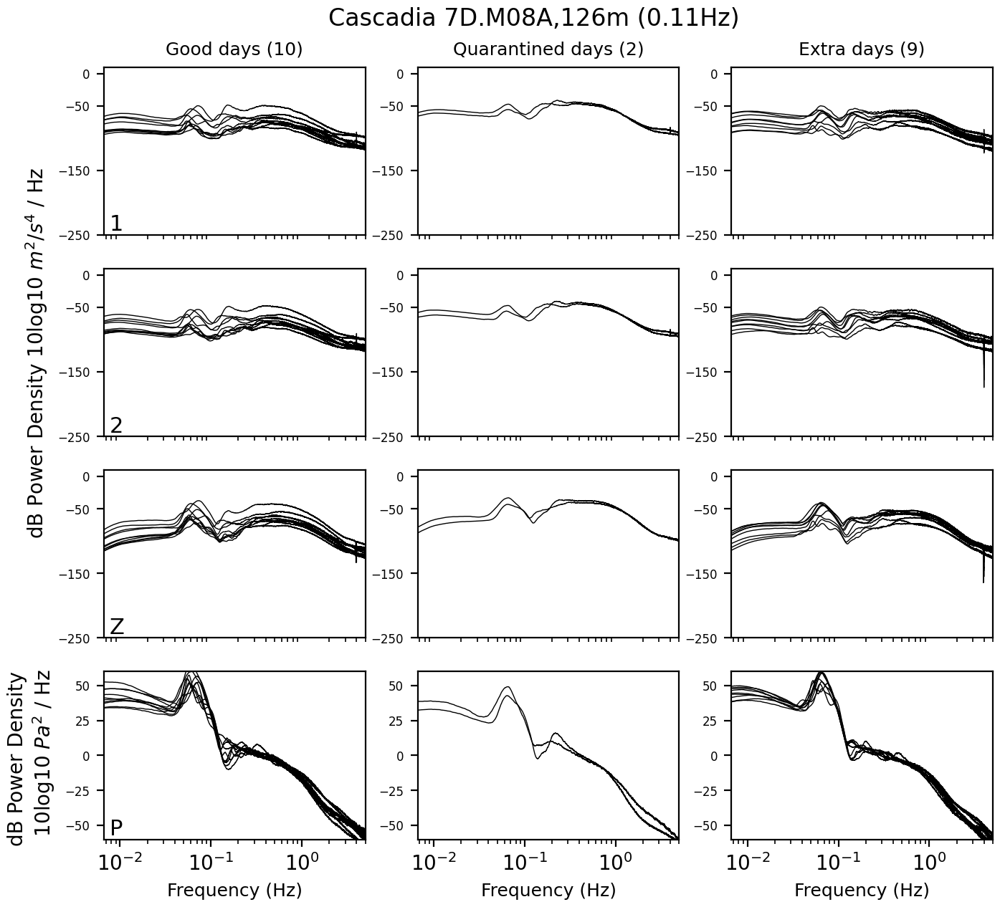
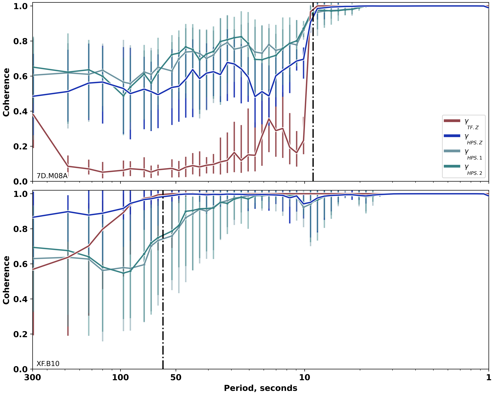
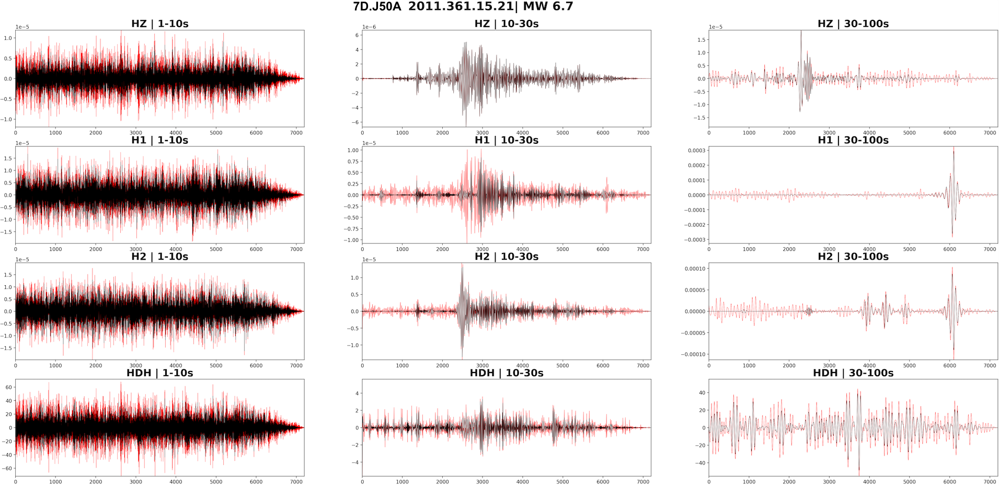
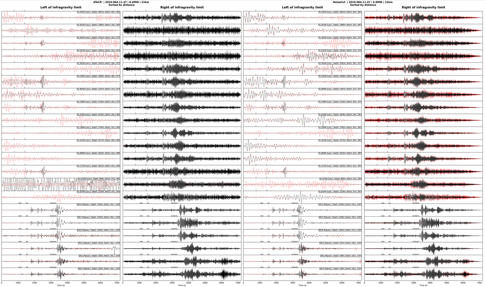
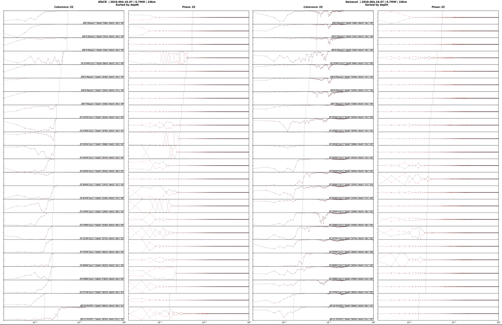

# Comparing noise reduction methods using transfer function or harmonic percussive separation. 

## Installation: 

```
git clone https://github.com/charleshoots/Discriminating_TransferFunctions_and_HarmonicPercussiveSeparation.git
```

```
cd Discriminating_TransferFunctions_and_HarmonicPercussiveSeparation
conda env create -f environment.yml
```

```
conda activate Seismic_TF_HPS_Comparison
```

## Download models:

```
python source/download_models.py
```

## Overview: 

#### The code in support of this analysis is broken up into four stages:
1. Data collection
2. Remove noise
3. Data quality analysis
4. Signal analysis

#### The primary figures used in publication of this analysis is broken up into two groups:
5. Publication Figures
6. Supplemental Figures

## 1. Data collection:
### Downloads the raw (SAC) dataset followed by deconvolution of instrument response. The dataset is maintained in both pre- and post- response removal.

### Using an organized catalog of source-receiver pairs, data is collected in three types: 
    a. 10 days of noise,
    b. 2-hour events, 
    c. 24-hour events (22-hours of noise precedding each origin time).
### Using the following codes:
    a. S00_DownloadData
    b. S01_Remove.Instrument.Response.from.Data

## 2. Remove noise:
### Remove noise from all available data organized by the catalog using NoiseCut and ATaCR. A de-noised version using each method is saved seperately from one another.

### Using the following codes:
    a. S02_AutoRunATaCR 
>> - A job master to delegate stations or source-receivers to process through any stage of ATaCR

    b. S03_AutoRunNoiseCut
>> - A job master to delegate component data collected from source-receiver pairs through NoiseCut.

## 3. Data Quality Analysis:
### Most data quality is assessed across multiple figures that are built by the following scripts:

    a. S04_RunNoiseDataQualityReport -
>> - Summary reports of noise data available or quarantined by the QC steps in ATaCR.


    b. S05_RunNoisePlots - 
>> - PSDs and cross-component metrics (coherence, admittance, and phase) of noise data.



    c. S06_RunStationPages - 
>> - Station average plots of HPSzz and TFzz coherences.



    d. S07_RunQuickHPSPlots - 
>> - Basic trace plots for events corrected (black) by HPS.




    e. S08_RunEventRecord_Trace_Sections - 
>> - A robust series of plots of event record sections for available events uncorrected (red) and corrected (black) by HPS and TF.



    f. S09_RunEventRecord_Metrics_Sections - 
>> - Also a record sections script but shows queried metrics instead of traces (ie signal coherence).



## 3. Run analysis:
### Build and organize a database of all relevant metrics. Particularly, SNR and coherence using either method.

### Using the following codes:
    a. S10_Collect.Event.COH.Metrics 

    b. S11_Collect.Event.SNR

    c. S12_Collect.Event.ADM.Metrics (optional)

    d. S13_Collect.Event.PH.Metrics (optional)

## 4. Publication Figures

    a. Figure1_RunMapsPlot

    b. Figure2_Methods.Example

    c. Figure3_DirectMetricComparisons_byDepth_within.or.regardless.of.IG

    d. Figure4_ConsolidatedPlots

    e. Figure5_CoherenceContourPlots

    f. Figure6_DirecComparisonAverages_by_DeploymentParams

    g. Figure7_Coherence.Spectra.by.DeploymentParam

    h. Figure8_SNR.SpectraBands.by.DeploymentParam

    i. Figure9_HighTilt.Plots

    j. Figure10_Coherence.with.HPS.Traces.Magnitude

    k. Figure11_MetricComparisonScatterPlots

    l. Figure11.part2_ExampleEvents.with.LostStructure

    m. Table2_Correlograms


## 5. Supplemental Figures
    a. FigureS1_MetaHistPlots

    b. FigureS9_Histograms

    c. FigureS10_Coh.vs.Coh.Scatter

    d. FigureS5_and_S8_CoherenceSpectraAverages

    e. FigureS14_NarrowSymmetryAnalysisPlots

    f. FigureS13_CoherenceScatter_by_Meta

    g. FigureS6_ComparativeHistogram


## License 
##### | With the exception of the ATaCR and NoiseCut scripts, every single line of code in this repository was written directly by Charles Hoots in service of his PhD dissertation research at the University of Hawai'i Manoa with zero external assistance or contributions from others. With advice contributed by Helen Janiszewski, every level of analysis was also done by Charles Hoots. Use of any analysis, data, or codes contained within is open-source, covered under the MIT License:
> https://github.com/charleshoots/ATACR_HPS_Comp/blob/main/LICENSE.txt

## References
Bell, S. W., D. W. Forsyth, and Y. Ruan (2014), Removing noise from the vertical component records of ocean-bottom seismometers: Results from year one of the Cascadia Initiative, Bull. Seismol. Soc. Am., 105, 300-313, https://doi.org/10.1785/0120140054

Crawford, W.C., Webb, S.C., (2000). Identifying and removing tilt noise from low-frequency (0.1 Hz) seafloor vertical seismic data, Bull. seism. Soc. Am., 90, 952-963, https://doi.org/10.1785/0119990121

Janiszewski, H A, J B Gaherty, G A Abers, H Gao, Z C Eilon, Amphibious surface-wave phase-velocity measurements of the Cascadia subduction zone, Geophysical Journal International, Volume 217, Issue 3, June 2019, Pages 1929-1948, https://doi.org/10.1093/gji/ggz051

Zali, Zahra, Theresa Rein, Frank Krüger, Matthias Ohrnberger, and Frank Scherbaum. “Ocean Bottom Seismometer (OBS) Noise Reduction from Horizontal and Vertical Components Using Harmonic–Percussive Separation Algorithms.” Solid Earth 14, no. 2 (2023): 181–95. https://doi.org/10.5194/se-14-181-2023.

NumPy – Harris, C. R. et al. (2020). Array programming with NumPy. Nature, 585, 357–362. https://doi.org/10.1038/s41586-020-2649-2

SciPy – Virtanen, P. et al. (2020). SciPy 1.0: Fundamental algorithms for scientific computing in Python. Nature Methods, 17, 261–272. https://doi.org/10.1038/s41592-019-0686-2

Pandas – McKinney, W. (2010). Data structures for statistical computing in Python. In Proceedings of the 9th Python in Science Conference (SciPy 2010), 51–56. https://doi.org/10.25080/Majora-92bf1922-00a

Librosa – McFee, B. et al. (2015). librosa: Audio and music signal analysis in Python. In Proceedings of the 14th Python in Science Conference (SciPy 2015), 18–25. https://doi.org/10.25080/Majora-7b98e3ed-003

ObsPy – Beyreuther, M., Barsch, R., Krischer, L., Megies, T., Behr, Y., & Wassermann, J. (2010). ObsPy: A Python toolbox for seismology/seismological observatories. Seismological Research Letters, 81(3), 530–533. https://doi.org/10.1785/gssrl.81.3.530

