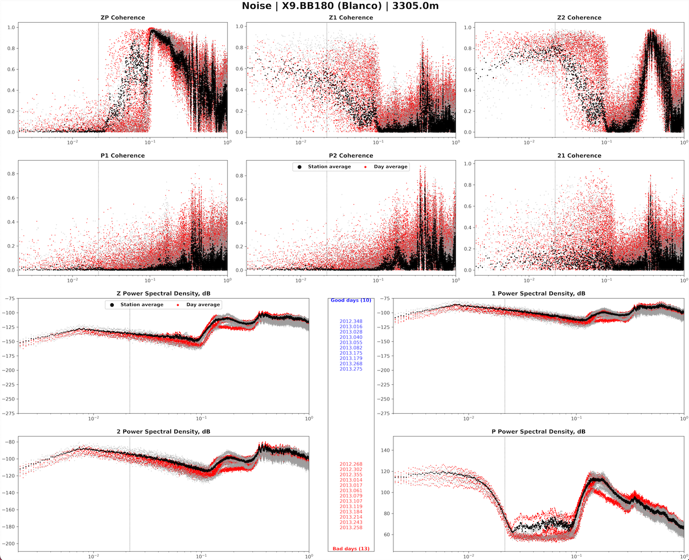

# Comparing noise reduction methods using transfer function or harmonic percussive separation. 

## Installation: 

```
git clone https://github.com/charleshoots/Discriminating_TransferFunctions_and_HarmonicPercussiveSeparation.git
```

```
cd Discriminating_TransferFunctions_and_HarmonicPercussiveSeparation
conda env create -f environment.yml
```

```
conda activate Seismic_TF_HPS_Comparison
```

## Download models (optional):
#### - After installation, our models containing coherence and SNR can be downloaded and unzipped into the repositories directory with the following script. 

```
python source/download_models.py
```

## Overview - Code in support of this analysis is broken up into five sections:


---
### **S00: Download events and remove noise.**
---

| S00.00_DownloadData.py |
|----------|
> ### A job script that tasks the obstools API with downloading events and noise data for use in NoiseCut and ATaCR.

| S00.01_Remove.Instrument.Response.from.Data.py |
|----------|
> ### Deconvolves the instrument response from all downloaded traces.

| S00.02_AutoRunATaCR.py |
|----------|
> ### A job script for removing noise from event data through transfer functions (TF) of cross-component coherent noise spectra using the ATaCR framework.

| S00.03_AutoRunNoiseCut.py |
|----------|
> ### A job script for removing noise from event data through Harmonic-Percussive Separation (HPS) using the NoiseCut framework.


---
### **S01: Collect signal measurements - coherence, admittance, phase, SNR, and SNR ratios.**
---
| S01.00_Collect.Event.Metrics.py |
|----------|
> ### Collects measurements of coherence, phase, and admittance between original and corrected traces using either HPS or TF.

| S01.01_Collect.SNR.py |
|----------|
> ### Collects measurements of SNR in user-defined windows around P/Pdiff, S/Sdiff, and Rayleigh surface waves before and after noise reduction using HPS or TF.

| S01.02_Record.Sections.w.SNR.py |
|----------|
> ### Detailed record sections showing the processing structure of SNR measurements. Namely phase and noise windows and resulting measurements for each event.

| S01.03_Collect.Noise.Metrics.py |
|----------|
> ### A detailed cross-component analysis of all noise data.

| S01.04.RunNoiseDataQualityReport.py |
|----------|
> ### Power-spectral densities of all noise data including quality controls from the ATaCR framework.
<details>
  <summary>(Example)</summary>
  
</details> 


---
### **S02: Data quality analysis based, automated QC, signal measurements, and record sections.**
---

| S02.00_RunStationPages.py |
|----------|
> ### Single station scatter plots of coherence spectra following corrections with HPS or TF.
<details>
  <summary>(Example)</summary>
  
</details> 

__
| S02.01_RunQuickHPSPlots.py |
|----------|

> ### Single single-receiver plots of traces after use of HPS to remove noise in all three seimic component data.
<details>
  <summary>(Example)</summary>
  
</details> 

__
| S02.02_RunEventRecord_Trace_Sections.py |
|----------| 

> ### Record sections for the qualitative comparison of changes following noise reduction using HPS and TF.
<details>
  <summary>(Example)</summary>
  
</details> 


---
### **S03: Figures of final results used for publication**
---


| S03.Figure01_RunMapsPlot.py |
|----------|
> ### Global and regional maps of all deployments in the catalog.
<details>
  <summary>(Example)</summary>
  
</details> 

__
| S03.Figure02_Methods.Example.py |
|----------|
> ### Directly comparing the two methods in a single example event using traces, spectrograms, and coherence.
<details>
  <summary>(Example)</summary>
  
</details> 

__
| S03.Figure03_DirectMetricComparisons_byDepth_within.or.regardless.of.IG.py |
|----------|
> ### Scatter plots showing a direct comparison of average coherence and SNR ratios clustered by regular depth intervals both within and regardless of infragravity sensitivity.
<details>
  <summary>(Example)</summary>
  
</details> 

__
| S03.Figure04_ConsolidatedPlot.py |
|----------|
> ### Consolidated overview plot of results.
<details>
  <summary>(Example)</summary>
  
</details> 

__
| S03.Figure05_CoherenceContourPlots.py |
|----------|
> ### Contour plot of coherence measurement averages with depth.
<details>
  <summary>(Example)</summary>
  
</details> 

__
| S03.Figure06_DirecComparisonAverages_by_DeploymentParams.py |
|----------|
> ### Scatter plots directly comparing coherences for each deployment parameter.
<details>
  <summary>(Example)</summary>
  
</details> 

__
| S03.Figure07_Coherence.Spectra.by.DeploymentParam.py |
|----------|
> ### Multiple coherence spectra for each deployment and event parameter.
<details>
  <summary>(Example)</summary>
  
</details> 

__
| S03.Figure08_SNR.SpectraBands.by.DeploymentParam.py |
|----------|
> ### Multiple snr ratio spectral averages for each deployment and event parameter.
<details>
  <summary>(Example)</summary>
  
</details> 

__
| S03.Figure09_HighTilt.Plots.py |
|----------|
> ### Coherence and SNR ratio distributions grouped by severity of vertical tilt as approximated from ZH coherence averages.
<details>
  <summary>(Example)</summary>
  
</details> 

__
| S03.Figure10_Coherence.with.HPS.Traces.Magnitude.py |
|----------|
> ### Spectra coherence between traces corrected with HPS and those corrected with TF.
<details>
  <summary>(Example)</summary>
  
</details> 

__
| S03.Figure11_MetricComparisonScatterPlots.py |
|----------|
> ### Various scatter plots comparing different signal measurements beyond just coherence and snr (ie phase signal amplitude ratios).
<details>
  <summary>(Example)</summary>
  
</details> 

__
| S03.Figure11.part2_ExampleEvents.with.LostStructure.py |
|----------|
> ### Example plot of selected events that demonstrate structure lost by noise reduction methods.
<details>
  <summary>(Example)</summary>
  
</details> 

__
| S03.Table02_Correlograms.py |
|----------|
> ### Correlation tables of measurement and deployment parameters.
<details>
  <summary>(Example)</summary>
  
</details> 

__

---
### **S04: Supplemental figures**
---

| S04.TableS01_MetaHistPlots.py |
|----------|
> ### Basic histograms of deployment and event parameters.
<details>
  <summary>(Example)</summary>
  
</details> 

__
| S04.FigureS05_and_S08_CoherenceSpectraAverages.py |
|----------|
> ### Coherence and SNR ratio spectral averages with depth.
<details>
  <summary>(Example)</summary>
  
</details> 

__
| S04.FigureS06_ComparativeHistogram.py |
|----------|
> ### Histograms of measurement comparisons (ie which method produces lower coherence or snr on average).
<details>
  <summary>(Example)</summary>
  
</details> 

__
| S04.FigureS09_Histograms.py |
|----------|
> ### Histograms of coherence and snr ratio distrubutions for each deployment and event parameter.
<details>
  <summary>(Example)</summary>
  
</details> 

__
| S04.FigureS10_Coh.vs.Coh.Scatter.py |
|----------|
> ### Scatter plots directly comparing each method's coherence when grouped by different deployment and event parameters.
<details>
  <summary>(Example)</summary>
  
</details> 

__
| S04.FigureS13_CoherenceScatter_by_Meta.py |
|----------|
> ### Scatter plots of coherence and SNR ratio spectral averages with different deployment parameters
<details>
  <summary>(Example)</summary>
  
</details> 

__
| S04.FigureS14_NarrowSymmetryAnalysisPlots.py |
|----------|
> ### Scatter plots for simultaneous cross-measurement comparison of TF and HPS using coherence and snr ratios.
<details>
  <summary>(Example)</summary>
  
</details> 

__

## License 
##### | With the exception of the ATaCR and NoiseCut scripts, every single line of code in this repository was written directly by Charles Hoots in service of his PhD dissertation research at the University of Hawai'i Manoa with zero external assistance or contributions from others. With advice contributed by Helen Janiszewski, every level of analysis was also done by Charles Hoots. Use of any analysis, data, or codes contained within is open-source, covered under the MIT License:
> https://github.com/charleshoots/ATACR_HPS_Comp/blob/main/LICENSE.txt

## References
Bell, S. W., D. W. Forsyth, and Y. Ruan (2014), Removing noise from the vertical component records of ocean-bottom seismometers: Results from year one of the Cascadia Initiative, Bull. Seismol. Soc. Am., 105, 300-313, https://doi.org/10.1785/0120140054

Crawford, W.C., Webb, S.C., (2000). Identifying and removing tilt noise from low-frequency (0.1 Hz) seafloor vertical seismic data, Bull. seism. Soc. Am., 90, 952-963, https://doi.org/10.1785/0119990121

Janiszewski, H A, J B Gaherty, G A Abers, H Gao, Z C Eilon, Amphibious surface-wave phase-velocity measurements of the Cascadia subduction zone, Geophysical Journal International, Volume 217, Issue 3, June 2019, Pages 1929-1948, https://doi.org/10.1093/gji/ggz051

Zali, Zahra, Theresa Rein, Frank Krüger, Matthias Ohrnberger, and Frank Scherbaum. “Ocean Bottom Seismometer (OBS) Noise Reduction from Horizontal and Vertical Components Using Harmonic–Percussive Separation Algorithms.” Solid Earth 14, no. 2 (2023): 181–95. https://doi.org/10.5194/se-14-181-2023.

NumPy – Harris, C. R. et al. (2020). Array programming with NumPy. Nature, 585, 357–362. https://doi.org/10.1038/s41586-020-2649-2

SciPy – Virtanen, P. et al. (2020). SciPy 1.0: Fundamental algorithms for scientific computing in Python. Nature Methods, 17, 261–272. https://doi.org/10.1038/s41592-019-0686-2

Pandas – McKinney, W. (2010). Data structures for statistical computing in Python. In Proceedings of the 9th Python in Science Conference (SciPy 2010), 51–56. https://doi.org/10.25080/Majora-92bf1922-00a

Librosa – McFee, B. et al. (2015). librosa: Audio and music signal analysis in Python. In Proceedings of the 14th Python in Science Conference (SciPy 2015), 18–25. https://doi.org/10.25080/Majora-7b98e3ed-003

ObsPy – Beyreuther, M., Barsch, R., Krischer, L., Megies, T., Behr, Y., & Wassermann, J. (2010). ObsPy: A Python toolbox for seismology/seismological observatories. Seismological Research Letters, 81(3), 530–533. https://doi.org/10.1785/gssrl.81.3.530

